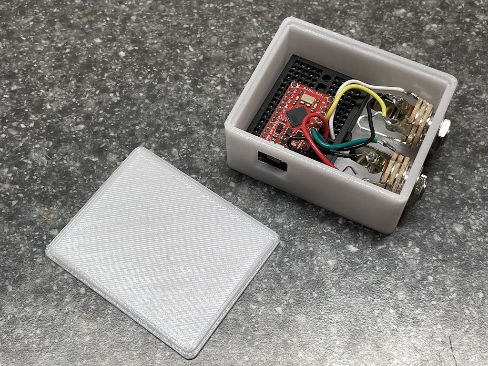

# README #

This is the hardware and case design for a widget I've built to interface generic foot switches (like those used to control guitar effects processors) to USB.

The device reports itself as either a USB HID gamepad with a configurable number of buttons, or as a keyboard which reports presses on F16, F17, etc. Switch between these modes by commenting/uncommenting the definition of `EMULATE_JOYSTICK` in footpedal.cpp.

The hardware is currently based around a Sparkfun Pro Micro (since that's what I had lying around):

https://www.sparkfun.com/products/12587

but it should be pretty trivial to adapt to other microcontrollers that have Arduino support in PlatformIO.

The code isn't too far off a generic "Gamepad" Arduino example that reports buttons and no hat switches or other axes, but it does have a couple of slightly interesting bits:

The `platformio.ini` file is set up to run `custom_config.py`, which changes the USB product identifier from the board's default to "Footpedals", which is slightly more user-friendly than the default "Sparkfun Pro Micro".

Configuration for the number and interpretation of buttons is done entirely through the contents of the `singlePins` and `triplePins` arrays. 
`triplePins` is set up to work with triple footswitches that interface through a 1/4" TRS plug, such as the [Digitech FS3X](https://www.digitech.com/foot-controllers/FS3X+3-Button+Footswitch.html) and similar units. These use a very simple circuit to multiplex 3 buttons over 2 signal wires. If you're connecting something like this, add the two pins you connect to the tip and ring connections of the jack to the `triplePins` array, and it will read all three switches out as buttons.

The `case.scad` file is an [OpenSCAD](https://www.openscad.org) model of a 3D-printable case that I created to hold a mini breadboard and a configurable number of 1/4" panel mount jacks. Changing `jack_count` in that file will expand the case to hold the number of jacks you choose. (If you set it below 2, there may not be room for the breadboard anymore.) `usb_h` and `usb_v` set the location of the hole for the USB jack, you may have to fiddle with the numbers to line it up with the plug on your breadboard/controller combo.

# BUILD #

I'm building this with PlatformIO/VSCode. Open the root directory of the repository directly with VSCode, and it should be ready to build.

I do my work on Mac OS X, so I don't know if there will be any issues using it on Windows or Linux.
